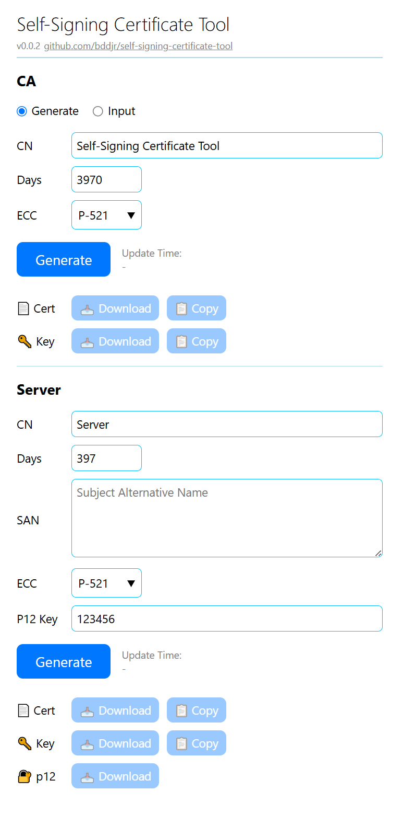

# Self-Signing Certificate Tool

## Download

[releases](https://github.com/bddjr/self-signing-certificate-tool/releases)

## Build from source

Need dependencies:
> [Git](https://git-scm.com)  
> [Go](https://go.dev)  

If on Windows, use git bash.

```
git clone https://github.com/bddjr/self-signing-certificate-tool
cd self-signing-certificate-tool
./build.sh
```

## Effect


